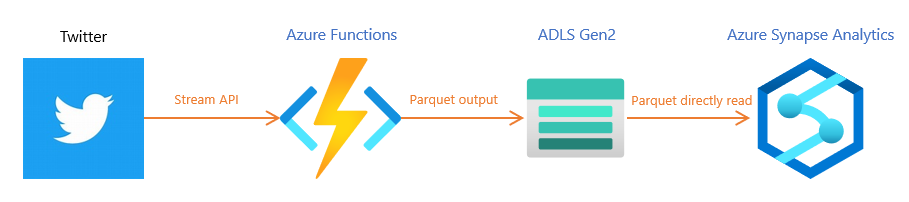

# Data analysis with Twitter API

 
<table>
   <tr><th>#</th><th>Description</th><th>Platform</th><th>Japanese documentation</th></tr>
   <tr><td>Step1</td><td>Twitter API - Sampled Stream V2 API</td><td>C# Console App (.NET Core/.NET 5)</td><td>https://qiita.com/dokums/items/e643a5dfbc85af97cf40</td></tr>
   <tr><td>Step2</td><td>Twitter API - Filtered Stream API</td><td>C# Console App (.NET Core/.NET 5)</td><td>https://qiita.com/dokums/items/fd4053dec59344405504</td></tr>
   <tr><td>Step3</td><td>Write Parquet file to local storage</td><td>C# Console App (.NET Core/.NET 5)</td><td>https://qiita.com/dokums/items/31c8d0f30e3796bfc648</td></tr>
   <tr><td>Step4</td><td>Write Parquet file to Azure Data Lake Storage Gen2 (ADLS Gen2)</td><td>C# Console App (.NET Core/.NET 5)</td><td>https://qiita.com/dokums/items/8285b53446300b66d9e1</td></tr>
   <tr><td>Step5</td><td>Azure Functions with Twitter API & ADLS Gen2</td><td>Azure Function App (C#)</td><td>https://qiita.com/dokums/items/3622bf1dc599fcbc5329</td></tr>
</table>
